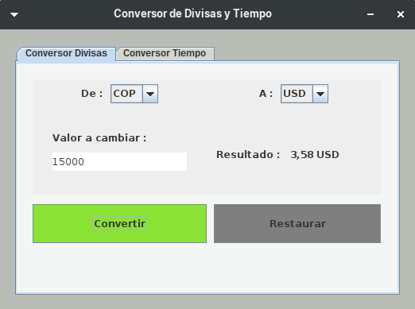
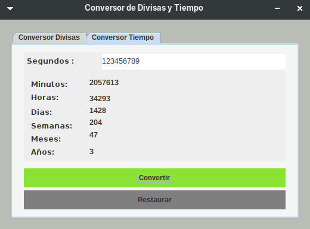

# ChallengeConversor
## Primer Challenge de la especialización Backend java de Oracle ONE
## Challenge ONE - G5

# Conversor
Descripción:

¡Primer desafío del Challenge Java!

En esta oportunidad, a los aprendices de Backend se nos solicitó crear un conversor de divisas utilizando el lenguaje Java, con las siguientes caracteristicas:

Requisitos:

El convertidor de moneda debe:
```		
  - Convertir de la moneda de tu país a Dólar
  - Convertir de la moneda de tu país  a Euros
  - Convertir de la moneda de tu país  a Libras Esterlinas
  - Convertir de la moneda de tu país  a Yen Japonés
  - Convertir de la moneda de tu país  a Won sul-coreano
   
  ``` 
   

Recordando que también debe ser posible convertir inversamente, es decir:
```
    - Convertir de Dólar a la moneda de tu país
    - Convertir de Euros a la moneda de tu país
    - Convertir de Libras Esterlinas a la moneda de tu país
    - Convertir de Yen Japonés a la moneda de tu país
    - Convertir de Won sul-coreano a la moneda de tu país

  ```

> En este caso la moneda de mi pais es COP (Pesos Colombianos).

# Extras:

Como desafío extra te animamos a que dejes fluir tu creatividad, si puedo convertir divisas, ¿tal vez pueda añadir a mi programa otros tipos de conversiones?

> Como desafio Extra me tome la tarea de crear otro tipo de conversor, en este caso realice un `Conversor de Segundos`, el cual trae el equivalente de segundos a:
  ```
	  -Minutos.
	  -Horas.
	  -Dias.
	  -Semanas.
	  -Meses.
	  -Años.

  ```

## Añadidos:

> Consumo de api Exchangered para la conversion de divisas; para el correcto funcionamiento de la aplicacion, se debe tener conexion a internet.

> Interfaz grafica con java.swing + windowBuilder de Eclipse IDE.

> Para el correcto funcionamiento de la aplicacion, se debe tener instalado el JDK de java, ya que se utiliza el mismo para la ejecucion de la aplicacion.

## Imagenes:

> 1. Conversor Divisas:



> 2. Conversor de Divisas Gif


> 3. Conversor de Segundos:




> 4. Conversor de segundos gif:


